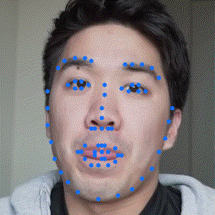

[](https://github.com/yliess86/FaceCrop/blob/master/LICENSE)
[](https://www.python.org/downloads/release/python-360/)
[](https://pytorch.org/)

# FaceCrop: a Tool for Face Cropped Videos


> #### Disclaimer
>
> Currently working on a better version.
> In this newer and cleaner version.
> I am aiming for stability imporvement and faster inference.
> All the models will thus be changed.

**FaceCrop** is a **Python** tool for face cropped videos. It allows you to infer face **region** and **landmarks** from **single person videos**. FaceCrop has been implemented with **batch inference** in mind allowing to treat the videos faster. It can be used to generate dataset for training Deep Learning models and such.

[original video](https://www.youtube.com/watch?v=uxRf7KS3abo)
|Full Frame         |Cropped Frame           |
|:-----------------:|:----------------------:|
|  | |

## Installation

### System Install

The **FaceCrop** module can be **installed** using the following command (may require sudo):

```bash
$ (sudo) python3 setup.py install
```

### Local usage

If you want to use the **FaceCrop** module **without installation**, you need at least to install all the modules required for its use (may require sudo):

```bash
$ (sudo) pip3 install -r requirements.txt
```

## Usage

The FaceCrop tool library is documented using **DocString** and each of its component can be used speratly. If you want to use the tools by yourself, see the corresponding source files in the `facetorch` folder.

The **FaceCrop tools** can be accessed directly with the following command:
```bash
$ python3 -m facecrop --help 
usage: facecrop [-h] --video_path VIDEO_PATH --annot_path ANNOT_PATH
[--video_size VIDEO_SIZE VIDEO_SIZE] [--batch_size BATCH_SIZE]
[--max_batch MAX_BATCH] [--device DEVICE] [-v] [-c] [-s]
```

|Argument  |Type |Number|Default  |Description                          |
|:---------|:----|-----:|--------:|:------------------------------------|
|video_path|str  |     1|     None|Path to the Video (mp4 by preference)|
|annot_path|str  |     1|     None|Path to the resulting annotation csv |
|video_size|tuple|     2|1280, 720|Frame size (the video may be resized)|
|batch_size|int  |     1|       16|Batch size (needs to fit on the GPU) |
|max_batch |int  |     1|     None|Usefull for short test or GIFs       |
|device    |str  |     1|      cpu|Device to run the inference on "cuda"|
|visualize |bool |     1|    False|Visualize the annotations            |
|crop      |bool |     1|    False|Crop the face when visualizing       |
|save      |bool |     1|    False|Save the visualization to GIF        |

## Annotations

This section display the **annotation format** resulting from the inference. The **annotations** will be saved as a **csv file** and can be retrieved using the **Pandas** library for example.

* **x {float}** - box x position
* **y {float}** - box y position
* **box_size {float}** - box size (max(max width, max height) of the sequence)
* **mark_[i]_[x/y] {float}** - landmark id i, x or y component of the face
* **frame_w {int}** - frame size width (resized when processed)
* **frame_h {int}** - frame size height (resized when processed)
* **sequence {int}** - sequence assignement (new seq when zero or more than one detection)

|time|    x|    y| box_size|mark_[i]_x|mark_[i]_y|frame_w|frame_h|sequence|
|---:|----:|----:|--------:|---------:|---------:|------:|------:|-------:|
|0.16|325.0|500.0|    230.0|     400.0|     528.0|   1280|    720|       1|
| ...|  ...|  ...|      ...|       ...|       ...|    ...|    ...|     ...|

## References

- [MTCNN](https://arxiv.org/pdf/1604.02878.pdf) - Kaipeng Zhang, Zhanpeng Zhang, Zhifeng Li, Yu Qiao, *"Joint Face Detection and Alignment using Multi-task Cascaded Convolutional Networks"*, IEEE Signal Processing Letters 2016 [Implementation Used](https://github.com/timesler/facenet-pytorch)
- [FAN](https://arxiv.org/pdf/1712.02765.pdf) - Adrian Bulat, Georgios Tzimiropoulos, *"Super-FAN: Integrated facial landmark localization and super-resolution of real-world low resolution faces in arbitrary poses with GANs"*, CVPR 2018 [Implementation Used](https://github.com/1adrianb/face-alignment)
